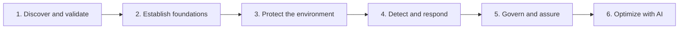

# Security Campaign

Atlanta, USA

[](https://github.com/)
[Cloud2BR OSS - Learning Hub](https://github.com/Cloud2BR-MSFTLearningHub)

Last updated: 2026-08-04

----------

> Interactive Microsoft cloud security decision map. Customer conditions produce
> an eligibility matrix, domain campaign tracks, and a phased implementation
> roadmap linked to eight specialist Cloud2BR learning hubs.



## Capabilities

- Eight-condition guided assessment with explicit unknown states.
- Deterministic and versioned recommendation catalog.
- Executive summary, eligibility matrix, campaign tracks, and phased roadmap.
- Local print, Markdown, and JSON exports with no backend persistence.
- Deep links to M365 E5/E7, Entra, Defender, Intune, Purview, Sentinel,
  Security Copilot, and Agent 365 guidance.

## Local development

```powershell
python -m pip install -r requirements.txt
node tests/recommendation-engine.test.js
node tests/source-links.test.js
python -m mkdocs serve
```

## Project structure

| Path | Purpose |
| --- | --- |
| `docs/assets/js/campaign-data.js` | Questions, source links, conditions, dependencies, and catalog version. |
| `docs/assets/js/recommendation-engine.js` | Pure evaluation and summary logic shared by every result view. |
| `docs/assets/js/campaign-app.js` | Assessment UI, result rendering, and local exports. |
| `docs/assets/css/custom.css` | Responsive decision-map and print presentation. |
| `tests/` | Scenario coverage, published source-link validation, and the browser smoke test. |
| `scripts/capture-screenshots.js` | Regenerates the README screenshots against a running `mkdocs serve` instance. |
| `images/` | README screenshots. Not part of the MkDocs build (`docs_dir: docs`). |

## Changing rules

1. Change questions or recommendations in `campaign-data.js`.
2. Increment `version` when recommendation behavior changes.
3. Add a scenario that proves the new condition or dependency.
4. Run both Node tests and `python -m mkdocs build --strict`.
5. Confirm output still distinguishes discovery, prerequisites, recommendations,
   and established capabilities.

<!-- START BADGE -->
<div align="center">
  
  <p>Refresh Date: 2026-04-08</p>
</div>
<!-- END BADGE -->
