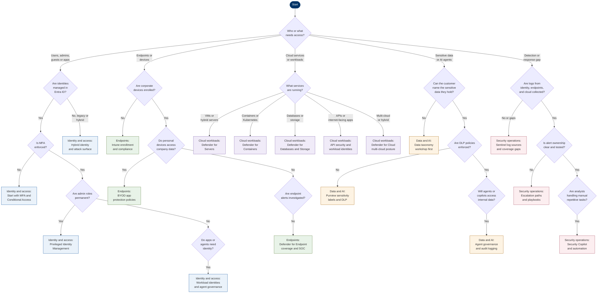

# Security Campaign

Use these decision maps to turn a customer environment into the security conversations worth having next. Start with what they operate, follow the route, and open the specialist implementation hub only when the route applies.

<a class="route-card route-foundation" href="identity-access/">01<strong>Identity and access</strong><small>Users, admins, guests, apps, and agents</small><b>Start here →</b></a>
<a class="route-card route-endpoint" href="endpoint-map/">02<strong>Endpoints and devices</strong><small>Corporate devices, BYOD, shared devices</small><b>Open map →</b></a>
<a class="route-card route-cloud" href="cloud-workload-map/">03<strong>Cloud workloads</strong><small>Compute, containers, data, storage, APIs, network</small><b>Open map →</b></a>
<a class="route-card route-data" href="data-ai-map/">04<strong>Data and AI</strong><small>Microsoft 365, SaaS, data platforms, agents</small><b>Open map →</b></a>
<a class="route-card route-operations" href="security-operations-map/">05<strong>Security operations</strong><small>Signals, investigations, response, automation</small><b>Open map →</b></a>

## Security decision map

Use this decision map to identify which security areas apply to the customer environment, then open the matching map for a detailed conversation.

## Start with the customer environment

<strong>Who or what needs access?</strong><a href="identity-access/">Users, admins, apps, or agents → Identity and access</a>

<strong>Are endpoints accessing company data?</strong><a href="endpoint-map/">Corporate, personal, or shared devices → Endpoints and devices</a>

<strong>Are cloud services in scope?</strong><a href="cloud-workload-map/">Compute, containers, databases, storage, APIs, or network → Cloud workloads</a>

<strong>Is sensitive data or AI involved?</strong><a href="data-ai-map/">Microsoft 365, SaaS, data platforms, copilots, or agents → Data and AI</a>

<strong>Does the customer need detection or response?</strong><a href="security-operations-map/">Identity, endpoint, cloud, network, or SaaS signals → Security operations</a>

## Use the maps in a customer conversation

1. Ask which services, data, and users are in scope.
2. Open the matching map and work through its decision points.
3. Capture named owners, evidence, and the first viable implementation scope.
4. Use the linked specialist hub for product-specific design and deployment guidance.

!!! info
    These maps support discovery and planning. They are not a tenant scan, compliance assessment, or licensing commitment. Confirm production decisions with customer evidence and Microsoft guidance.
