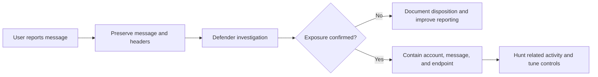
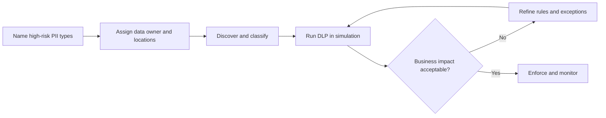
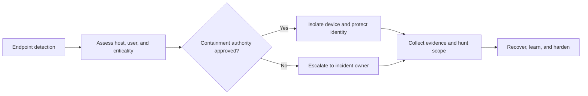
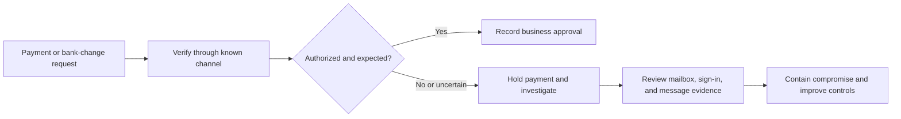
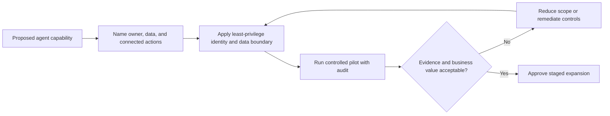

# Security Use Cases and Technical Examples

List of references

- [Microsoft Defender for Office 365 overview](https://learn.microsoft.com/en-us/defender-office-365/defender-for-office-365)
- [Report suspicious emails in Microsoft Defender for Office 365](https://learn.microsoft.com/en-us/defender-office-365/submissions-users-report-message-add-in-configure)
- [Investigate phishing threats in Microsoft Defender for Office 365](https://learn.microsoft.com/en-us/defender-office-365/anti-phishing-investigate)
- [Microsoft Purview data loss prevention](https://learn.microsoft.com/en-us/purview/dlp-learn-about-dlp)
- [Learn about trainable classifiers](https://learn.microsoft.com/en-us/purview/classifier-learn-about)
- [Learn about Endpoint DLP](https://learn.microsoft.com/en-us/purview/endpoint-dlp-learn-about)
- [Microsoft Entra ID Protection](https://learn.microsoft.com/en-us/entra/id-protection/overview-identity-protection)
- [Microsoft Defender for Endpoint overview](https://learn.microsoft.com/en-us/defender-endpoint/microsoft-defender-endpoint)
- [Microsoft Defender for Cloud Apps overview](https://learn.microsoft.com/en-us/defender-cloud-apps/what-is-defender-for-cloud-apps)
- [Microsoft Sentinel automation rules](https://learn.microsoft.com/en-us/azure/sentinel/automate-incident-handling-with-automation-rules)
- [Microsoft Entra Privileged Identity Management](https://learn.microsoft.com/en-us/entra/id-governance/privileged-identity-management/pim-configure)
- [Manage mailbox permissions in Exchange Online](https://learn.microsoft.com/en-us/exchange/recipients-in-exchange-online/manage-permissions-for-recipients)
- [Microsoft Purview data security and governance for Microsoft 365 Copilot](https://learn.microsoft.com/en-us/purview/ai-microsoft-purview)

Use these scenarios after a customer identifies a security concern. Each example
starts with the evidence needed to scope the issue, separates immediate response
from sustainable controls, and identifies the Microsoft security capabilities to
validate. These are implementation-planning examples, not incident-response
instructions for an active emergency.

!!! info "Visual guidance"
    The diagrams on this page are original planning views based on the Microsoft Learn sources above. They show the evidence, control points, and handoffs to validate; use the linked Microsoft Learn articles for product UI and configuration procedures.

## 1. Suspected phishing email

**Customer signal:** A user reports a suspicious message, a credential-harvest
link, an unexpected attachment, or an invoice request that looks legitimate.

| What to gather | Technical actions to plan | Validate before closing the use case |
| --- | --- | --- |
| Original message, recipient list, message ID, full headers, URLs, attachment hashes, reported time, and user actions | Enable and test user reporting; investigate message delivery and URLs; search for matching messages; assess whether a credential was entered; review sign-in, mailbox-rule, and endpoint activity | An owner can determine scope, remove or quarantine related messages where appropriate, contain affected identities or devices, and document why the message was benign or malicious |

**Core control path:** Microsoft Defender for Office 365 for reporting,
investigation, and remediation; Microsoft Entra ID Protection and Conditional
Access for risky identity follow-up; Microsoft Defender for Endpoint when the
user opened a file or link; Microsoft Sentinel when the organization needs
cross-signal investigation and repeatable response automation.

**Implementation example:** Start with a pilot group that can report messages
from Outlook. Create an incident checklist that requires the analyst to record
the message ID, affected recipients, URL/domain verdict, user interaction, and
containment decision. Test a benign simulation and a known phishing sample in a
safe lab before enabling automatic response actions.

## 2. PII may exist across Microsoft 365, endpoints, or cloud storage

**Customer signal:** The organization cannot confidently identify where customer
records, employee identifiers, payment information, or health information live,
or it suspects users are sending that data outside approved channels.

| What to gather | Technical actions to plan | Validate before enforcing |
| --- | --- | --- |
| Data types and regulations, business owners, Microsoft 365 locations, endpoints, SaaS applications, cloud storage, current labels, and known exceptions | Define sensitive information types and, where justified, trainable classifiers; create sensitivity labels; configure DLP policies in simulation; add Endpoint DLP for USB, print, browser, and untrusted-cloud actions | Detection matches the intended PII, policy hits have business-owner review, exceptions are time-bound and approved, and users receive understandable policy tips |

**Core control path:** Microsoft Purview Information Protection and DLP for
classification and prevention; Endpoint DLP for local-device movement; Microsoft
Defender for Cloud Apps for sanctioned/unsanctioned SaaS discovery and monitoring;
Microsoft Sentinel for correlation with identity or data-access signals.

**Implementation example:** Begin with one high-value data type, such as customer
payment details. Run a DLP policy in simulation for four weeks across Exchange,
SharePoint, OneDrive, and Teams. Review every policy hit with the data owner,
then extend the proven policy to managed Windows endpoints before considering
broader SaaS controls.

## 3. Risky sign-in after an email or password event

**Customer signal:** A user reports entering credentials on a suspicious site,
or the security team finds impossible travel, unfamiliar device, token, or MFA
activity.

| What to gather | Technical actions to plan | Validate before closing the use case |
| --- | --- | --- |
| User, timestamps, IP addresses, device IDs, sign-in and audit logs, MFA method changes, Conditional Access results, privileged roles, and applications accessed | Review risky users and sign-ins; revoke sessions when compromise is credible; reset credentials and verify MFA methods; review mailbox rules, OAuth consent, and privileged-role activations; hunt for related sign-ins | The identity has a known owner, sessions and high-risk tokens are addressed, MFA methods are verified, privileged access is reviewed, and the user/device receives a clean bill of health or a documented remediation plan |

**Core control path:** Microsoft Entra ID Protection for risk signals, Entra
Conditional Access for risk-based access decisions and trusted-device
requirements, Defender for Endpoint for device context, and Sentinel for
correlating sign-in activity with email, endpoint, and cloud events.

## 4. Ransomware or suspicious endpoint behavior

**Customer signal:** Endpoint alerts show mass file changes, suspicious
encryption tools, credential dumping, lateral movement, or unusual outbound
connections.

| What to gather | Technical actions to plan | Validate before closing the use case |
| --- | --- | --- |
| Device name, user, alert timeline, process tree, file paths, persistence details, network destinations, backup state, and business criticality | Define isolation authority; enable endpoint detection and response; connect identity and endpoint telemetry; test device isolation and recovery; prepare ransomware, credential-compromise, and critical-server playbooks | The team can isolate a non-production test device, retain required evidence, identify affected identities and neighboring assets, recover from known-good backups, and record who approves each containment action |

**Core control path:** Microsoft Defender for Endpoint for detection,
investigation, and device containment; Microsoft Defender for Cloud for server
and workload posture where relevant; Microsoft Sentinel for incident
orchestration, cross-domain hunting, and automation rules.

## 5. Possible SaaS or cloud data exfiltration

**Customer signal:** A customer-data export, mass download, permission change, or
unusual cloud-storage transfer occurs outside normal working patterns.

| What to gather | Technical actions to plan | Validate before closing the use case |
| --- | --- | --- |
| Application name, actor, data owner, export scope, audit-log retention, destination, network context, approved business process, and current access model | Onboard the relevant SaaS and cloud audit logs; establish baselines for export volume and privileged actions; require least-privilege access; review external sharing; correlate export activity with risky sign-ins and managed-device status | The organization can identify who exported which data, whether access was authorized, where the data went, which logs prove the finding, and which control prevents recurrence |

**Core control path:** Microsoft Defender for Cloud Apps for SaaS discovery,
activity visibility, and governance; Microsoft Purview for sensitive-data
classification and DLP; Microsoft Entra for access and session controls;
Microsoft Sentinel for log correlation, detection, and incident response.

## 6. Business email compromise or payment fraud request

**Customer signal:** Finance receives an urgent request to change bank details,
approve an invoice, redirect a payment, or share payroll data. The sender may
impersonate an executive, supplier, or a compromised employee mailbox.

| What to gather | Technical actions to plan | Validate before closing the use case |
| --- | --- | --- |
| Original request, supplier contact on record, invoice or bank-change details, approver, message headers, mailbox rules, delegate access, sign-in events, and payment status | Require out-of-band verification through a known supplier contact; investigate message origin and mailbox rules; review delegated and shared-mailbox access; protect high-risk finance users with phishing-resistant authentication and targeted anti-phishing controls | Finance can prove that a payment or bank change was independently verified, the affected mailbox and identity were investigated, suspicious forwarding or delegate changes were removed, and the payment process has a named exception authority |

**Core control path:** Microsoft Defender for Office 365 for impersonation and
mail investigation; Microsoft Entra for strong authentication and risky-sign-in
follow-up; Exchange Online for mailbox permission and forwarding review;
Microsoft Sentinel for cross-signal investigation where payment-fraud cases need
consistent triage and evidence retention.

## 7. Privileged-access abuse or exposed administrator account

**Customer signal:** An administrator account has permanent broad access, an
unexpected role assignment occurs, emergency access is used, or a privileged
sign-in originates from an unfamiliar device or location.

| What to gather | Technical actions to plan | Validate before closing the use case |
| --- | --- | --- |
| Role assignments, activation history, approvals, administrator sign-ins, device compliance, emergency-access records, service principals, and affected resources | Inventory permanent privileged roles; require just-in-time elevation with approval for high-impact roles; separate daily and administrator accounts; protect privileged access with Conditional Access and phishing-resistant authentication; alert on role changes and emergency-account use | Every broad role has a business owner and review cadence, just-in-time access is tested for a pilot role, emergency accounts are controlled and monitored, and the team can trace a high-impact administrative change to an approved identity and ticket |

**Core control path:** Microsoft Entra Privileged Identity Management for
eligible assignments, approvals, activation, and access reviews; Conditional
Access and device compliance for privileged sign-ins; Microsoft Sentinel for
role-change and high-risk sign-in correlation.

## 8. Copilot or AI agent needs access to internal data and tools

**Customer signal:** A business team wants a copilot or agent to search internal
content, summarize customer records, create tickets, or act through connected
systems, but owners cannot yet describe its data boundary or approval path.

| What to gather | Technical actions to plan | Validate before enabling broad access |
| --- | --- | --- |
| Business owner, intended users, data sources, permissions, connected actions, sensitivity labels, retention requirements, audit events, human approval points, and rollback owner | Use a dedicated least-privilege identity; restrict agent data sources to an approved subset; apply Purview labels and DLP where appropriate; require human approval for consequential actions; log prompts, actions, and failures in the approved operational system | A pilot demonstrates the agent cannot access unapproved data or perform unapproved actions, audit evidence identifies the user and agent activity, data owners approve the boundary, and the team can disable or roll back the integration quickly |

**Core control path:** Microsoft Entra workload identities and least-privilege
permissions; Microsoft Purview for data classification and protection; Microsoft
Defender and Sentinel for monitoring relevant identity, endpoint, cloud, and data
signals. Expand only after ownership, auditing, and response authority are clear.

## Turn a concern into a technical pilot

1. Choose one scenario and one business owner.
2. Collect the evidence named in the scenario before changing a production control.
3. Identify the minimum telemetry, licensing, roles, and approval authority needed.
4. Pilot in report-only or monitored mode where the control can disrupt business work.
5. Define success measures: detection fidelity, false-positive rate, response time,
   business impact, and evidence retained for review.
6. Document the approved response or enforcement decision, then expand one data
   type, user group, device group, or application at a time.

!!! warning
    For a suspected active compromise, follow the organization's incident-response plan and escalation process. Do not wait for a campaign workshop or a documentation review to contain a verified threat.